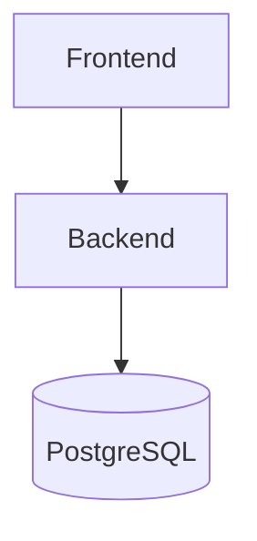
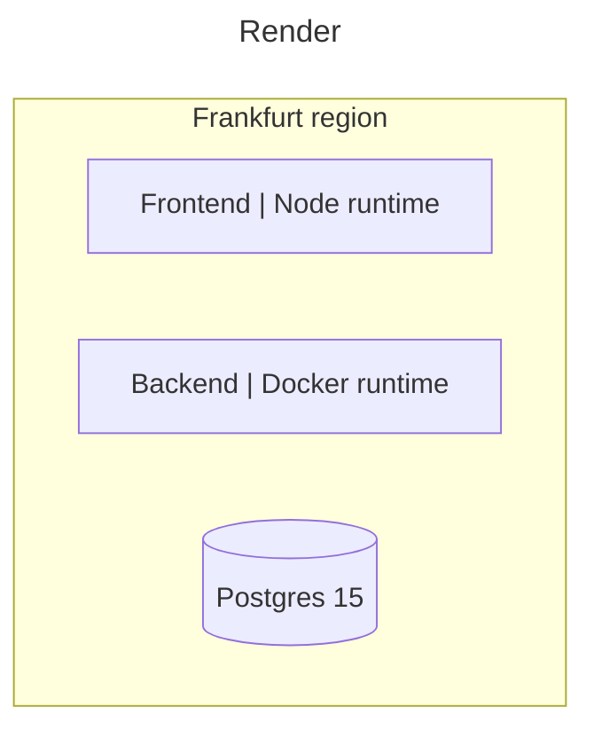
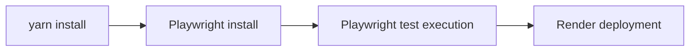
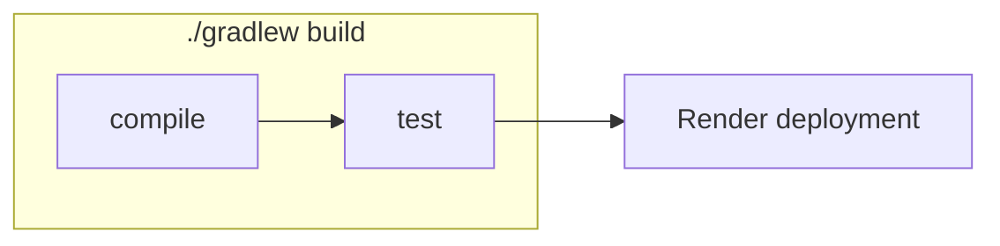

# monorepo template

## Local environment setup

### Dependencies

- Node 18
- Java 17
- Docker

### Running locally

- Backend
  - `./gradlew runTestApp`
  - or run: `dev.aleixmorgadas.monorepo.run.TestApplication`
- Frontend
  - `yarn install`
  - `yarn dev`

## Tech stack

- Frontend
  - [NextJS][nextjs]
  - [TailwindCSS][tailwindcss]
  - [Playwright][playwright]
- Backend
  - [Spring Boot 3][springboot]
- Database
  - [Postgres 15][postgres]
- Providers
  - Authentication Provider: [Auth0][auth0]
  - Email Provider: [Sendinblue][sendinblue]
  - Analytics: [Amplitude][amplitude]

## Architecture

## Infrastructure

We are using [render.com][render] to deploy and run our application. Using [Render Blueprints][render-blueprints],
we defined our deployment as [`render.yaml`](./render.yaml).

All components are in the [free plan][render-free].

## Deployment pipelines

### Frontend

Workflow: [frontend.yml](./.github/workflows/frontend.yml)

### Backend

Workflow: [backend.yml](./.github/workflows/backend.yml)

[nextjs]: https://nextjs.org/
[tailwindcss]: https://tailwindcss.com/
[playwright]: https://playwright.dev/
[springboot]: https://spring.io/projects/spring-boot
[postgres]: https://www.postgresql.org/
[auth0]: https://auth0.com/
[amplitude]: https://amplitude.com/
[sendinblue]: https://sendinblue.com/
[render]: https://render.com
[render-blueprints]: https://render.com/docs/blueprint-spec
[render-free]: https://render.com/docs/free

